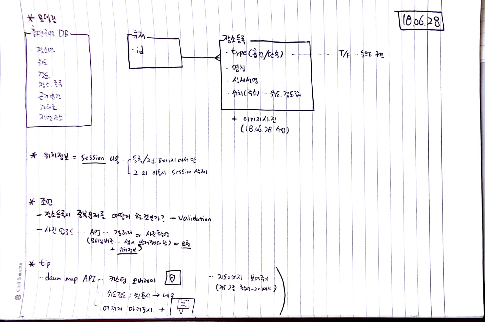
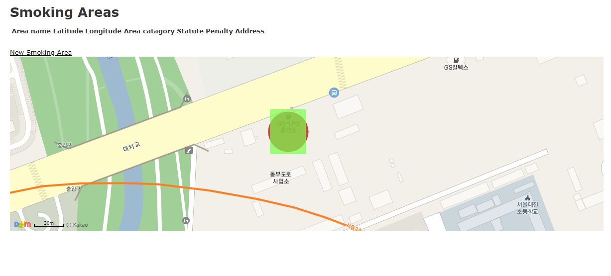

# 18.06.25


````
- 카톡 플러스친구 생성
- 루비 on rails 생성
- 왓슨과 카톡 연결 시도
````


`````
ruby on rails 설정

gem install rails
rvm install 2.3.4
bundle install
rails -v

rails g model map   
rails g controller maps


------------------
dongho0892:~ $ rails _5.0.6_ new smoking
dongho0892:~ $ cd smoking

dongho0892:~/smoking $  rails g scaffold smoking_area area_name:string latitude:integer longitude:integer area_catagory:string statute:string penalty:integer address:string

dongho0892:~/smoking $ rails g scaffold user user_name:string

dongho0892:~/smoking $ rails g scaffold place_register type:boolean area_name:string description:text address:string latitude:integer longitude:integer
`````




#### DB 칼럼 설정 + Scaffold

* Smoking_area : 흡연장소 등록		- 공공데이터
  * 장소명 : area_name : string
  * 위도 : latitude : integer
  * 경도 : longitude : integer
  * 장소 종류 : area_catagory : string
  * 근거 법령 : statute : string
  * 과태료 : penalty
  * 주소(지번) : address
* user : 카카오톡 유저 생성
  * user_name : string
* place_register : 장소 등록 ( 흡연 장소 / 단속장소 )   -  유저등록
  * 장소종류 : area_type : string    (확장 가능성 대비)
  * 장소명 : area_name : string
  * 장소 설명 : description : text
  * 주소 : address : string
  * 위도 : latitude : integer
  * 경도 : longitude : integer

----------

````ruby
dongho0892:~/smoking $ rake db:migrate
````




#### index.html.erb 에 내용 추가

````html
<div id="map" style="width:100%;height:350px;"></div>
<script type="text/javascript" src="//dapi.kakao.com/v2/maps/sdk.js?appkey=1ff16577c702fbde5a0877cc98c9dee0"></script>

<script>
var mapContainer = document.getElementById('map'), // 지도를 표시할 div 
    mapOption = { 
        center: new daum.maps.LatLng(37.4977796, 127.0755652), // 지도의 중심좌표
        level: 3 // 지도의 확대 레벨
    };  

var map = new daum.maps.Map(mapContainer, mapOption); // 지도를 생성합니다

var latitude = 37.4977796
var longitude = 127.0755652   // 위도 경도 자료 위치 #########################################


// 지도에 표시할 원을 생성합니다
var circle = new daum.maps.Circle({
    center : new daum.maps.LatLng(37.4977796, 127.0755652),  // 원의 중심좌표 입니다 
    radius: 20, // 미터 단위의 원의 반지름입니다 
    strokeWeight: 1, // 선의 두께입니다 
    strokeColor: '#b30000', // 선의 색깔입니다
    strokeOpacity: 0.7, // 선의 불투명도 입니다 1에서 0 사이의 값이며 0에 가까울수록 투명합니다
    strokeStyle: 'solid', // 선의 스타일 입니다
    fillColor: '#b30000', // 채우기 색깔입니다
    fillOpacity: 0.7  // 채우기 불투명도 입니다   
}); 

// 지도에 원을 표시합니다 
circle.setMap(map); 

var sw = new daum.maps.LatLng(latitude + 0.0002, longitude + 0.0002), // 사각형 영역의 남서쪽 좌표
    ne = new daum.maps.LatLng(latitude - 0.0002, longitude - 0.0002); // 사각형 영역의 북동쪽 좌표

// 사각형을 구성하는 영역정보를 생성합니다
// 사각형을 생성할 때 영역정보는 LatLngBounds 객체로 넘겨줘야 합니다
var rectangleBounds = new daum.maps.LatLngBounds(sw, ne);

// 지도에 표시할 사각형을 생성합니다
var rectangle = new daum.maps.Rectangle({
    bounds: rectangleBounds, // 그려질 사각형의 영역정보입니다
    strokeWeight: 1, // 선의 두께입니다
    strokeColor: '#79ff4d', // 선의 색깔입니다
    strokeOpacity: 0.7, // 선의 불투명도 입니다 1에서 0 사이의 값이며 0에 가까울수록 투명합니다
    strokeStyle: 'solid', // 선의 스타일입니다
    fillColor: '#79ff4d', // 채우기 색깔입니다
    fillOpacity: 0.7 // 채우기 불투명도 입니다
});

// 지도에 사각형을 표시합니다
rectangle.setMap(map);


</script>
````

#### import CSV 파일 : https://hcn1519.github.io/articles/2016-11/rails_import_csv

rails_db 설치 : 위도 경도 등 데이터 넣거나 확인 할 곳

```
gem 'rails_db', '2.0.2'
bundle install
```

* csv 파일 업로드를 위한 csv파일과 db 순서 맞춰주기
* csv 파일 업로드 : public/smoking_areas.csv  
  * 주의사항
    * 메모장으로 urf-8 설정해줄 것
    * 전체열 다 소문자로 해주고, 공백은 _으로 바꿔줄 것.
* csv 파일 업로드를 위한 코드 작성 : lib/tasks/import_smoking_areas_csv.rake

````ruby
require 'csv'
namespace :import_smoking_areas_csv do
  task :create_smoking_areas => :environment do
    CSV.foreach("public/smoking_areas.csv", :headers => true, :header_converters => :symbol) do |row|
      SmokingArea.create!(row.to_hash)
    end
  end
end

# 문제 : ActiveModel::UnknownAttributeError: unknown attribute 'area_name' for SmokingArea.
# 	원인 : 헤더가 모두 소문자가 아니거나 / 공백이 있거나 / 철자가 잘못되었거나..
# 	해결 :   :header_converters => :symbol를 추가하여 db 저장 완료함.
#	   + :header_converters => :symbol 옵션 = 
#      = 이 옵션은 헤더를 소문자로 변환하고, 공백을 밑줄로 바꾸고, 심볼로 변환하여 헤더를 변환합니다. 

# + 위도 경도 : integer => float로 수정!
````

https://stackoverflow.com/questions/45581233/unknown-attribute-error-on-csv-upload

https://hcn1519.github.io/articles/2016-11/rails_import_csv

```` 
dongho0892:~/smoking (master) $ rake import_smoking_areas_csv:create_smoking_areas
````

#### index.html.erb 에 내용 추가

````html
<p id="notice"><%= notice %></p>

<h1>Smoking Areas</h1>

<!--<table>-->
<!--  <thead>-->
<!--    <tr>-->
<!--      <th>Area name</th>-->
<!--      <th>Latitude</th>-->
<!--      <th>Longitude</th>-->
<!--      <th>Area catagory</th>-->
<!--      <th>Statute</th>-->
<!--      <th>Penalty</th>-->
<!--      <th>Address</th>-->
<!--      <th colspan="3"></th>-->
<!--    </tr>-->
<!--  </thead>-->

<!--  <tbody>-->
<!--    <#% @smoking_areas.each do |smoking_area| %>-->
<!--      <tr>-->
<!--        <td><#%= smoking_area.area_name %></td>-->
<!--        <td><#%= smoking_area.latitude %></td>-->
<!--        <td><#%= smoking_area.longitude %></td>-->
<!--        <td><#%= smoking_area.area_catagory %></td>-->
<!--        <td><#%= smoking_area.statute %></td>-->
<!--        <td><#%= smoking_area.penalty %></td>-->
<!--        <td><#%= smoking_area.address %></td>-->
<!--        <td><#%= link_to 'Show', smoking_area %></td>-->
<!--        <td><#%= link_to 'Edit', edit_smoking_area_path(smoking_area) %></td>-->
<!--        <td><#%= link_to 'Destroy', smoking_area, method: :delete, data: { confirm: 'Are you sure?' } %></td>-->
<!--      </tr>-->
<!--    <#% end %>-->
<!--  </tbody>-->
<!--</table>-->

<br>

<%= link_to 'New Smoking Area', new_smoking_area_path %>


<!-- -->
<!-- -->
<!-- -->

<div id="map" style="width:100%;height:350px;"></div>
<script type="text/javascript" src="//dapi.kakao.com/v2/maps/sdk.js?appkey=1ff16577c702fbde5a0877cc98c9dee0"></script>

<script>
var mapContainer = document.getElementById('map'), // 지도를 표시할 div 
    mapOption = { 
        center: new daum.maps.LatLng(37.4977796, 127.0755652), // 지도의 중심좌표
        level: 3 // 지도의 확대 레벨
    };  

var map = new daum.maps.Map(mapContainer, mapOption); // 지도를 생성합니다

var latitude = []; 
var longitude = [];    // 위도 경도 자료 위치
var sw = [],          //   배열 생성
    ne = [];
var rectangleBounds = [];
 
<% @smoking_areas.each do |smoking_area| %>
   
latitude = <%= smoking_area.latitude %>   // 한번씩 뽑아서 위도, 경도에 넣어줌.
longitude = <%= smoking_area.longitude %> 

// // 지도에 표시할 원을 생성합니다
// var circle = new daum.maps.Circle({
//     center : new daum.maps.LatLng(37.4977796, 127.0755652),  // 원의 중심좌표 입니다 
//     radius: 20, // 미터 단위의 원의 반지름입니다 
//     strokeWeight: 1, // 선의 두께입니다 
//     strokeColor: '#b30000', // 선의 색깔입니다
//     strokeOpacity: 0.7, // 선의 불투명도 입니다 1에서 0 사이의 값이며 0에 가까울수록 투명합니다
//     strokeStyle: 'solid', // 선의 스타일 입니다
//     fillColor: '#b30000', // 채우기 색깔입니다
//     fillOpacity: 0.7  // 채우기 불투명도 입니다   
// }); 

// // 지도에 원을 표시합니다 
// circle.setMap(map); 

sw = new daum.maps.LatLng(latitude + 0.0002, longitude + 0.0002), // 사각형 영역의 남서쪽 좌표
ne = new daum.maps.LatLng(latitude - 0.0002, longitude - 0.0002); // 사각형 영역의 북동쪽 좌표

// 사각형을 구성하는 영역정보를 생성합니다
// 사각형을 생성할 때 영역정보는 LatLngBounds 객체로 넘겨줘야 합니다
rectangleBounds = new daum.maps.LatLngBounds(sw, ne);

// 지도에 표시할 사각형을 생성합니다
var rectangle = new daum.maps.Rectangle({
    bounds: rectangleBounds, // 그려질 사각형의 영역정보입니다
    strokeWeight: 1, // 선의 두께입니다
    strokeColor: '#FBEFF5', // 선의 색깔입니다
    strokeOpacity: 0.7, // 선의 불투명도 입니다 1에서 0 사이의 값이며 0에 가까울수록 투명합니다
    strokeStyle: 'solid', // 선의 스타일입니다
    fillColor: '#FBEFF5', // 채우기 색깔입니다
    fillOpacity: 0.7 // 채우기 불투명도 입니다
});
// 지도에 사각형을 표시합니다
rectangle.setMap(map);
<% end %>

</script>
````

