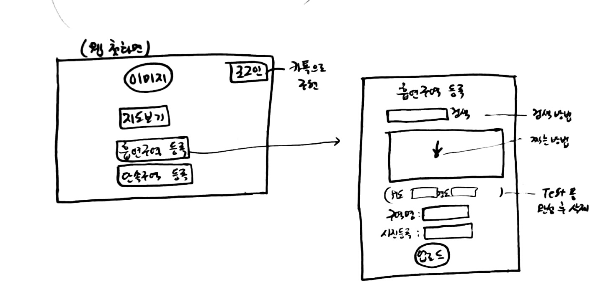
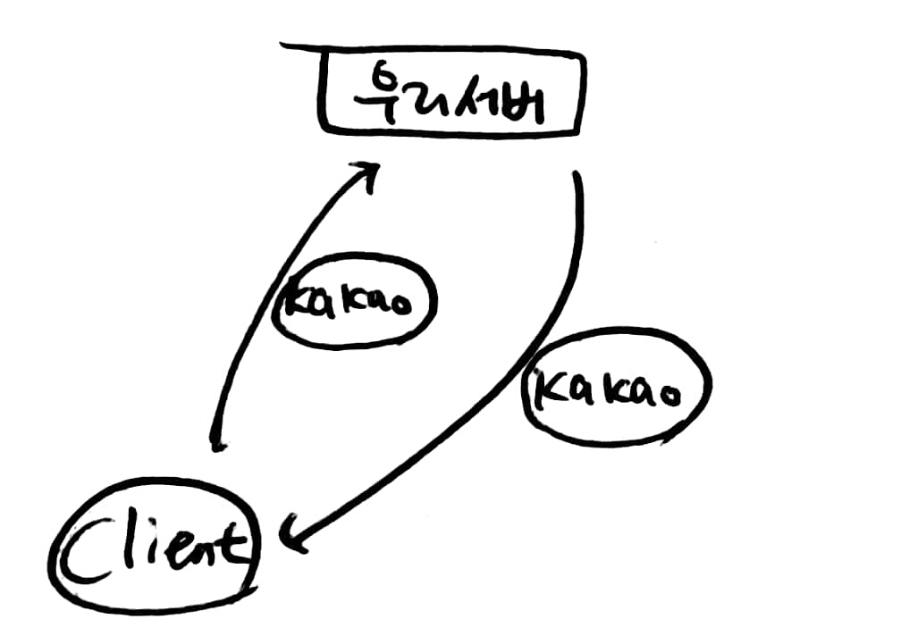

## 멋사 프로젝트 회의록

### 날짜 : 18.06.18

##### 참여자 : 파티장 : 동규 / 파티원 : 동호

##### 회의 내용 :


##### 	1차 아이디어톤 발표 구성

````
1. 팀명

2. 아이디어명	:	카톡 챗봇 기반, 금연/흡연 구역 알리미

3. 어플 기획의도	: 흡연자들이 벌금을 내지 않고 담배를 필 수 있는 장소를 제공하여,
				 그들의 만족을 극대화 하기 위함
			    : 흡연 장소 데이터가 많이 쌓일 경우 그 주변 지역에 흡연구역 설치를
			     자치구에 요청할 수도 있음. 
	
4. 전체 흐름 ( 챗봇 / 웹 ) + 중간중간 기능별 사용되는 API 설명

5. 전체 흐름을 보여주는데, 순서도 비슷한 것을 넣을지는 우선 패스
````


##### 	화면 구성 논의

 




##### 				해야할 일

````목록
1. 카톡 상으로 내 현재 위치 정보를 어떻게 받아서 서버에 요청할 것인가?
	- else : 웹페이지(우리서버)로 링크를 걸어서 보여줌.
			(크롬의 경우 google 위치코드를 활용하여 현위치 확인 가능함)
			
2. 챗봇의 기능이 적은데, 어떤 기능을 더 넣을 것인가? (구현 가능 한 것)

3. 웹페이지 로그인은 카카오톡 계정으로 해서 로그인 기능 구현하기

4. 어떤 것을 먼저 구현할 것인가?
````


##### 				특이사항			

````기타
- 모든 지도 = GPS or IP 기반으로 근거리가 뜨게끔 설정
- 공공 데이터 사용시에 데이터 빈 것, 중복되는 것 확인 후 쓸 것!
````


##### 				느낀점

````동호
 - 
````

